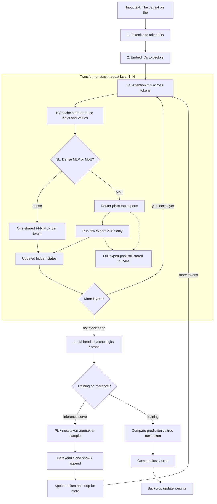
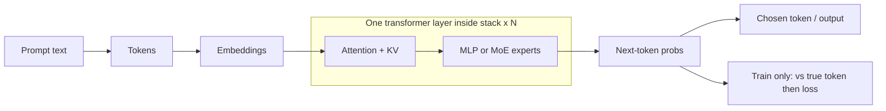

# Adventures In AI Coding 4
## FreeToken

Run a larger model than what your VRAM allows.

**Series:** [AI_Coding](https://github.com/Vince-0/AI_Coding) → [AdventuresInAICoding](https://github.com/Vince-0/AdventuresInAICoding) → [AdventuresInAICoding2](https://github.com/Vince-0/AdventuresInAICoding2) → [AdventuresInAICoding3](https://github.com/Vince-0/AdventuresInAICoding3) → **#4 FreeToken**

**Upstream:** [FlashML-org/FreeToken](https://github.com/FlashML-org/FreeToken) · [docs/models.md](https://github.com/FlashML-org/FreeToken/blob/main/docs/models.md) · [paper arXiv:2608.16157](https://arxiv.org/abs/2608.16157)

---

## Key concepts

| Acronym | Stands for | Brief explanation |
|---------|------------|-------------------|
| **WSL** | Windows Subsystem for Linux | Linux environment on Windows; this adventure runs Ubuntu + CUDA inside WSL |
| **VRAM** | Video RAM | On-GPU memory (here: RTX 3080 **10 GB**) - holds attention, expert cache, and KV, not the full MoE expert pool |
| **GPU** | Graphics Processing Unit | The NVIDIA card doing inference; VRAM is its fast local memory |
| **MoE** | Mixture of Experts | Sparse model: only a few “experts” activate per token, but the **full** expert pool still needs storage somewhere |
| **KV** | Key-Value (cache) | Per-token attention state kept during generation; larger context → more KV memory |
| **LRU** | Least Recently Used | Cache eviction policy - FreeToken keeps hot experts in VRAM and drops cold ones first |
| **GGUF** | GPT-Generated Unified Format | Common llama.cpp weight file format (quantized `.gguf`); Adventures #3’s stack |
| **MTP** | Multi-Token Prediction | Speculative decoding that drafts several tokens per step - #3’s speed story on fitted GGUFs |

### LLM theory (serial story)

How a local LLM turns a sentence into the next token - and where MoE, KV, training loss, and FreeToken’s memory story sit in that pipeline.

#### Theory glossary

| Term | Brief explanation |
|------|-------------------|
| **Token / tokenization** | Text split into pieces the model knows (often subwords), each mapped to an integer **token ID** |
| **Embedding** | Lookup that turns each token ID into a vector (list of numbers) - the starting **hidden state** |
| **Transformer layer** | One repeat of attention + feed-forward (dense MLP or MoE); models stack many layers |
| **Attention** | Lets each position mix information from other tokens in the sequence (“what context matters?”) |
| **Query / Key / Value** | Internal attention projections; **KV cache** stores past Keys and Values so generation need not recompute the whole prompt every step |
| **MLP / FFN** | Multi-Layer Perceptron / feed-forward network after attention - transforms each token on its own (expand → nonlinearity → shrink) |
| **Dense model** | One shared MLP/FFN per layer for every token - all those weights run every step |
| **Expert** | One MLP/FFN in an MoE bank - same job as a dense FFN, own weights; router picks a few per token |
| **Router (gating)** | Small network that scores experts and selects top-k for this token |
| **Expert pool** | **All** expert weight tensors across MoE layers - full storage footprint even when only a few experts run |
| **Sparse compute** | Only selected experts execute per token; most of the pool stays idle for that step |
| **Logits / softmax** | Raw vocab scores then probabilities for “what token comes next?” |
| **Decoding** | Choosing a token from that distribution (argmax or sampling) during **inference** |
| **Inference (serve)** | Forward-only generation loop used by FreeToken / llama.cpp / chat - no ground-truth token, no loss step |
| **Training** | Forward pass plus compare to the **true** next token → **loss** → backprop updates weights |
| **Loss / error** | Training-only measure of how wrong the predicted distribution was vs the actual next token (e.g. cross-entropy) |
| **Detokenize** | Map generated token IDs back to readable text |

#### Serial story

**0. Raw input** - e.g. `The cat sat on the`

**1. Tokenization** - tokenizer → token IDs (illustrative, not exact):  
`The` `cat` `sat` `on` `the` → `[15496, 3797, 3290, 319, 262]`

**2. Embedding** - each ID becomes a vector; the sentence is now a sequence of hidden states.

**3. Stack of transformer layers** (repeat many times):

- **3a. Attention (+ KV)** - positions look at each other and mix context. During generation, past **K/V** are cached; longer context → more KV memory (often in VRAM).
- **3b. Dense MLP or MoE** - after attention, each token hits a feed-forward block. **Dense:** one shared FFN. **MoE:** a bank of **expert** FFNs + a **router**; only top-k experts run (**sparse compute**), but the **expert pool** still needs a home (FreeToken: host RAM + LRU expert cache in VRAM).

**4. Prediction head** - final linear layer (**lm_head**) → logits → usually softmax → distribution over the vocabulary.

**Branch A - Inference (serving):** pick next token → append → loop until stop. No “actual” next token and no error signal in the loop; quality is judged later (benchmarks, humans).

**Branch B - Training:** compare predicted distribution to the true next token from the dataset → **loss** → backprop updates weights (embeddings, attention, MLPs/experts, router, …).

One-line summary for this adventure:

- **Forward:** input → tokens → vectors → attention (+ KV when generating) → MLP or MoE → next-token prediction.
- **Train only:** prediction vs true next token → loss → update weights.
- **Serve only:** prediction → chosen token → stream output (what FreeToken does).

#### Mermaid - full flow (train vs serve)

Attention, KV, and dense MLP / MoE live **inside** each transformer layer; that layer block repeats N times. Tokenize/embed are before the stack; LM head and train/serve branch are after.



#### Mermaid - one decode step



---

## Why

Because the cloud is someone else's computer and AI usage credits aren't cheap. Adventures #3 got models that **already fit** a 10GB card running **faster** (MTP on small GGUFs). This round asks a different question: which Mixture-of-Experts models that **don't fit VRAM** can still run at interactive speed on the same box?

Usual local LLM rule: **weights + KV must fit in VRAM**. MoE breaks the *compute* side of that story (few experts active per token) but not the *storage* side - the full expert pool is still huge.

**FreeToken’s premise:** keep experts in **host RAM**, use the GPU as attention + an **LRU expert cache**, and on misses stream over **PCIe** (`offload`) or run on CPU / hybrid. Success on a gaming PC is “MoE larger than VRAM runs at interactive speed,” not “buy a 48GB card.”

---

## How

Get FreeToken serving on WSL, calibrate bandwidth, filter [models.md](https://github.com/FlashML-org/FreeToken/blob/main/docs/models.md) against ~27 GiB host RAM, then measure tok/s and a small Python pass/fail set - same spirit as #3’s Hermes benchmarks, different memory wall.

### Environment

**OS:** Windows 11 with WSL Ubuntu 24.04

| Spec | Value | Implication |
|------|-------|-------------|
| GPU | RTX 3080 **10GB** (sm_86) | Cache + KV live here - not the full expert pool |
| Host RAM (WSL) | **~27 GiB** (`memory=28GB` in `.wslconfig`) | **Primary MoE fit gate** - measure with `free -h` inside WSL |
| CUDA | Toolkit **13.2** for FreeToken JIT; **12.8** kept for llama.cpp | FreeToken needed `nvcc` 13.x on PATH (kept both toolkits) |
| Disk | **5400RPM** | Hurts download / cold load; not steady PCIe H2D once resident |
| FreeToken | **0.1.2** from source | `ft serve` / `ft launch` / `ft ctl` |

**Sizing rule:** host RAM holds the expert pool (prefer ≲20-23 GB NVFP4 on this box); VRAM holds attention + MoE cache + KV.

### Novelty (vs the usual options)

| Approach | Idea | Gap on this question |
|----------|------|----------------------|
| **llama.cpp / Ollama** | Quantize until weights (+ KV) fit | Huge MoE expert pools still awkward; oversized GGUF thrash when ≫ RAM |
| **vLLM / dense “fit the card”** | High-throughput serving for fitted weights | Wrong product for “35B MoE on 10GB VRAM” |
| **“Just buy VRAM”** | Bigger card holds more | Expensive; doesn’t use MoE sparsity + host RAM as the design center |
| **FreeToken** | Host-resident experts + GPU cache + bandwidth-aware miss path | Built so **total MoE size ≫ VRAM** is normal |

This adventure is a **filter + measure** story: what FreeToken’s support matrix allows on **~27 GiB RAM**, not a claim that DeepSeek-class MoEs run on a 3080.

### What FreeToken claims (vs what we measured)

| Claim | On this PC |
|-------|------------|
| Run MoEs ≫ VRAM via host-RAM experts | **Yes** - gpt-oss / Gemma / Qwen NVFP4 |
| Interactive tok/s on RTX 30-class | **Yes** - ~24-46 tok/s Layer B |
| Bandwidth-adaptive hybrid | Calibrated; **`offload` won** (CPU/PCIe ratio &lt; 2×) |
| Elastic MoE cache ↔ KV | **Yes** - live `ft ctl cache rebuild --kv/--moe` |
| Agent drop-in APIs | **Yes** - Hermes one-shot via `ft launch` |
| DeepSeek / GLM / Flash-Next class | **Out of scope** - host RAM / PLE |

### Install + calibration

```bash
# FreeToken 0.1.2 from source (uv / venv) - see upstream docs/install.md
# Point CUDA_HOME at 13.2 toolkit so JIT finds nvcc

ft --version
ft bench bw --dtype nvfp4,bf16
# This box: CPU STREAM ~49.5 GB/s · PCIe H2D ~26.8 GB/s → prefer --moe-backend offload
```

One model at a time on ~27 GiB. Example serve (speed config):

```bash
ft serve --model ~/LLM/models/hf/gpt-oss-20b --served-model-name gpt-oss-20b \
  --host 127.0.0.1 --port 1919 --moe-backend offload --moe-cache-auto \
  --kv-reserve-tokens 4096 --memory-ratio 0.85 --max-running-requests 1
```

HF tip: `openai/gpt-oss-20b` full repo ~41 GB - exclude `metal/*` and `original/*` (~13 GB MXFP4 only).

---

## Models

**Filter:** FreeToken known-good **MoE** (or offload-family) checkpoints that fit **~27 GiB** with headroom. Reject famous names that need workstation RAM, and dense/`fused` SKUs that won’t demo host-RAM experts on 10 GB.

### Top-5 shortlist (why these)

| # | Role | Checkpoint | Why |
|---|------|------------|-----|
| 1 | Warmup → **preferred FT daily driver** | `openai/gpt-oss-20b` (~13 GB MXFP4) | Most RAM headroom; proven stack |
| 2 | Mid MoE | `nvidia/Gemma-4-26B-A4B-NVFP4` (~18.8 GB) | Different lab; still under 27 GiB |
| 3 | Mid-large | `RedHatAI/Muse-Glimmer-30B-NVFP4` (~23 GB) | Same band as Qwen - **rejected** (dense) |
| 4 | **Headline MoE** | `nvidia/Qwen3.6-35B-A3B-NVFP4` (~23.5 GB) | Largest runnable FT MoE here |
| 5 | Engine baseline | llama.cpp `Qwen3.6-35B-A3B-Q8_0.gguf` (~35 GB) | Same family, different wall |

### Results - FreeToken MoE / offload

| # | Model | On-disk | Layer B tok/s | Python C0 | Notes |
|---|--------|---------|---------------|-----------|-------|
| 1 | `openai/gpt-oss-20b` (MXFP4) | ~13 GB | **~45.5** | **19/24** | **Preferred FreeToken overall / daily driver:** fastest stable FT decode; best C0; RAM headroom; Hermes `PHASE7_OK`. **vs #3 agent host:** ~3× *slower* than `Qwen3.5-4B-MTP` (~135 tok/s) but **much stronger** on C0 (~19/24 vs ~6-8/28) |
| 2 | `nvidia/Gemma-4-26B-A4B-NVFP4` | ~18.8 GB | **~24.0** | **8/24** | Slower + weaker C0; CPU MoE layers + mlock - not preferred for Hermes |
| 4 | `nvidia/Qwen3.6-35B-A3B-NVFP4` | ~23.5 GB | **~35.7** | deferred | **Headline MoE** (largest runnable FT MoE): ≫VRAM proof; ~20 GiB RAM; pageable CPU experts. **Not** the snappy Hermes host |

### Prior agent host (llama.cpp - Adventures #3)

| Model | Decode / C0 (`results_python.log`) | Role vs FreeToken #4 |
|-------|--------------------------------------|----------------------|
| `Qwen3.5-4B-MTP-Q4_K_M.gguf` | ~**130-148** tok/s; ~**5-8/28** | **Snappy Hermes/OpenCode pick** - best throughput/UX feel; weaker coding oracles than gpt-oss |
| `Qwen3.5-9B` Q4 / Sushi Q4 | ~**50-90** tok/s; ~**2-7/28** | Mid llama.cpp path |
| `Qwen3.6-35B-A3B-Q8_0.gguf` | cold ~**0.2** / warm ~**17** | Same family as FT headline; **loses** to NVFP4 offload (~35.7) - poor agent UX on this box |

**Agent split (product, not one winner):**

| Need | Pick |
|------|------|
| Snappy interactive coding/chat | `Qwen3.5-4B-MTP` (llama.cpp) |
| Stronger FreeToken default / Hermes on `:1919` | `gpt-oss-20b` |
| Demo MoE ≫ VRAM | `Qwen3.6-35B-A3B-NVFP4` |

FreeToken **does not mix** MTP + MoE-offload on these checkpoints (MTP heads dropped at load). Treat as dual configs.

### Rejected / failed for the MoE story

| Model | Why |
|-------|-----|
| **Muse-Glimmer-30B-NVFP4** | Engine: **dense** / no routed experts → `fused`; won’t fit 10 GB. Support list ≠ MoE architecture |
| DeepSeek-V4-Flash / GLM-5.x / Qwen3.8-Flash-Next | Expert pools / PLE ≫ 27 GiB (≈160-512 GB-class host RAM) |
| Dense Qwen3.8-27B as FreeToken MoE demo | Wrong product (`fused`) |
| Kimi / Moonshot class | Not on FreeToken known-good list + huge |

### Context ↔ MoE cache

On gpt-oss, KV and MoE cache share the ~**4 GiB** rebuild budget. Advertised `ctx=131072` ≠ allocated KV (default smoke used **~4k** pages).

Growing `--kv` alone fails when MoE is already near the ceiling. Live resize must set **both**:

```bash
ft ctl cache rebuild --kv N --moe M --wait 300
```

Layer B short-decode sweep on gpt-oss (2026-09-09):

| KV target | MoE slots | MoE / KV pool | Mean tok/s | GPU used |
|-----------|-----------|---------------|------------|----------|
| 4096 | 316 | 3.9 GiB / 96 MiB | **44.4** | ~8.5 GiB |
| 32768 | 200 | 2.5 GiB / 768 MiB | **31.4** | ~7.9 GiB |
| 65536 | 120 | 1.5 GiB / 1.5 GiB | **22.9** | ~7.7 GiB |

~**48%** decode drop from speed config → long-ctx on this short prompt. Publish **two configs**: speed (small KV, big MoE cache) vs long-ctx (large KV, smaller cache). 200k is an aspiration to measure, not a default on 10 GB.

---

## Agent harness

### Hermes

```bash
ft launch hermes --dry-run    # → http://127.0.0.1:1919/v1 , model gpt-oss-20b
ft launch hermes -y -- chat -q "Reply with exactly the string PHASE7_OK and nothing else." -Q --max-turns 1
# → PHASE7_OK
```

One-shot proves the OpenAI-compatible wire. Fuller multi-task agent packs are deferred - the open product question is interactive feel vs snappy MTP (~135 tok/s on #3’s 4B host).

Same C0 spirit as #3: pinned Python function names, pass/fail parse. gpt-oss landed **19/24** after fixing prompt name pinning (had looked like 5/24 when the oracle and the model disagreed on symbols).

### Opencode

```bash
ft launch opencode --dry-run
```

Provider wiring is shorter than #3’s llama.cpp `auth.json` tinkering - `ft launch` prints the endpoint. Multi-turn coding loops still feel the tok/s gap vs MTP; I didn’t chase a Tetris.html rematch on FreeToken.

---

## FreeToken terms (deeper)

<details>
<summary>How FreeToken uses the jargon above (click to expand)</summary>

| Term | Meaning here |
|------|----------------|
| **Expert pool** | Full MoE weights in **host RAM** |
| **MoE cache** | LRU subset of experts resident in **VRAM**; misses → PCIe/`offload` or CPU |
| **`offload` vs `hybrid`** | Miss policy; pick with `ft bench bw` (this box: offload) |
| **KV reserve** | Allocated context pages - not the marketing max ctx |
| **NVFP4 / MXFP4** | Weight formats that make consumer MoEs fit ~27 GiB RAM |
| **TTFT vs decode tok/s** | Prefill/latency to first token vs steady generation - don’t mix into one number |
| **Quantization** | Fewer bits per weight → smaller files / less RAM. Q4 / NVFP4-class is the consumer sweet spot here |
| **Agent harness** | Hermes / OpenCode (etc.) driving a local OpenAI-compatible server for multi-step tool use |

**Memory walls on this PC**

- **VRAM (10 GB):** attention + MoE cache + KV - not the expert pool
- **Host RAM (~27 GiB):** expert pool fit gate - measure inside WSL, not Task Manager
- **Disk (HDD):** cold load / download only; steady decode is PCIe / CPU once resident

</details>

---

## Lessons for self-hosted infra

1. **RAM = MoE fit gate; VRAM = cache + KV gate.**
2. **PCIe H2D offload ≠ disk** - HDD hurts load, not steady decode once resident.
3. **WSL RAM ≠ Task Manager** - measure with `free -h` inside the guest.
4. **Support matrix ≠ architecture** - Muse taught that.
5. **Same-family Q8 GGUF can lose to NVFP4/offload** when weights ≫ RAM.
6. **Pin/mlock limits** on large MoEs → pageable CPU experts; expect jitter.
7. **Eval oracles need pinned API names** - C0 jumped 5/24 → 19/24 on gpt-oss.
8. Rank **pass × wall** (and harness), not tok/s alone - gpt-oss ~45 @ 19/24 vs #3 MTP ~135 @ ~6-8/28.
9. **KV↑ without MoE↓ fails** - rebuild both; 4k/316 → 64k/120 costs ~half short-decode tok/s.
10. On limited hardware, prefer **most capable model at acceptable interactive tok/s** - dual hosts (snappy MTP vs capable MoE), not one fake winner.
11. Default **Q4/NVFP4-class** weights; climb a rung for code/numbers - don’t chase unloadable BF16.

**Purchase hypotheses (not yet ROI-proven):** SSD → less wait; **≥64 GB RAM** → larger MoEs / fewer pageable layers; **≥24 GB VRAM** → long ctx + large MoE cache together. Neither alone unlocks Flash-Next/DeepSeek-class FreeToken (≈128-192 GB+ host RAM).

---

## Issues encountered

| Symptom | Workaround / lesson |
|---------|---------------------|
| Cold load ~minutes on HDD | Exclude from tok/s; warmup before measure |
| `ft bench bw` → offload not hybrid | Ratio &lt; 2× on this host - use offload |
| HF gpt-oss ~41 GB for “13 GB” model | `--exclude metal/* original/*` |
| Empty `content` on short `max_tokens` | gpt-oss reasoning budget - `reasoning_effort=low` |
| C0 5/24 then 19/24 | Pin required function names in prompts |
| Muse “MoE” fail | Dense / fused - drop from MoE matrix |
| llama.cpp `-ngl 99` on 35 GB Q8 | Abort; use `-fit on`; still loses to FT NVFP4 |
| `rebuild --kv 32k` alone → 503 | Pass `--moe` down with `--kv` |
| mlock / RLIMIT_MEMLOCK on large MoEs | Pageable CPU layers; raise ulimit or more RAM |

---

## Reflections

FreeToken’s **consumer MoE** story **holds** on a 3080 + ~27 GiB WSL box for gpt-oss / Gemma / Qwen NVFP4. The interesting work was not “it runs,” but **filtering**, **honest baselines**, and **memory knobs** (KV vs MoE cache).

There is still so much to learn and the pace of new MoE / quant / agent harness releases is thick and fast. I don’t know everything - but I know which wall I’m hitting now (host RAM), and which dual configs I’d actually leave running.

**What I’d run day-to-day**

- Snappy agent loops → still **Qwen3.5-4B-MTP** (~135 tok/s).
- FreeToken / OpenAI-compatible `:1919` → **gpt-oss-20b** (~45 tok/s, best C0 here).
- Show-and-tell ≫VRAM MoE → **Qwen3.6-35B-A3B-NVFP4**.

Next software (optional): Qwen C0, longer Hermes task packs, measure a personal interactive tok/s floor. Publish path: `Vince-0/AdventuresInAICoding4` when ready (no weights / secrets).

---

## Links

- [FreeToken](https://github.com/FlashML-org/FreeToken) · [models.md](https://github.com/FlashML-org/FreeToken/blob/main/docs/models.md) · [paper](https://arxiv.org/abs/2608.16157)
- [0xSero local-ai-frontier](https://huggingface.co/spaces/0xSero/local-ai-frontier) (external Pareto framing - other hardware)
- Prior series: [AdventuresInAICoding3](https://github.com/Vince-0/AdventuresInAICoding3)
- Local lab notes: C0 harness under `opencode/benchmark_python_*` · baselines `results_python.log` · benches `phase6_bench.py`, `phase6_ctx_sweep.py`, `bench-results/`
